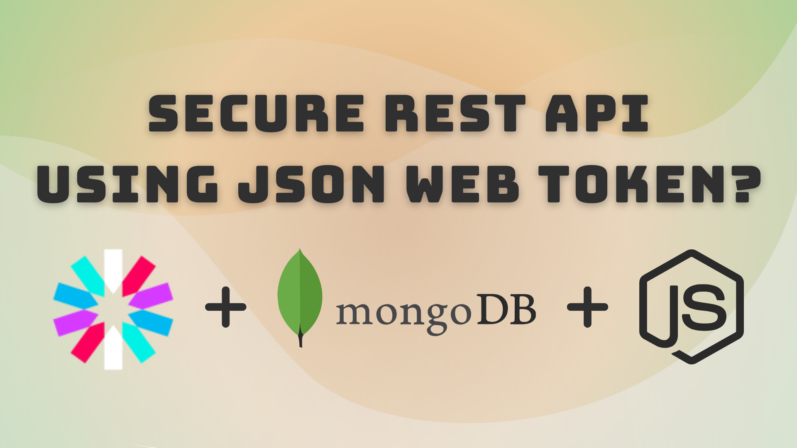

# Secure Node.js API

## Getting started



To get started with this project, run

```bash
git clone https://github.com/Vishakha-Sawra/secure-nodejs-api.git
```

and copy the .env.example variables present in the into a separate .env file, fill that and run the below command to install all the dependencies.

```bash
  npm install
```

And then run the command **npm start** to start the server, and it will run on localhost:3000

```bash
  npm start
```

And the test the API endpoints on Postman. 